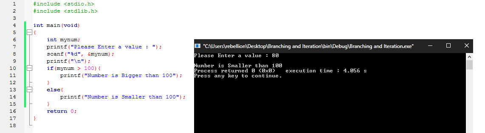
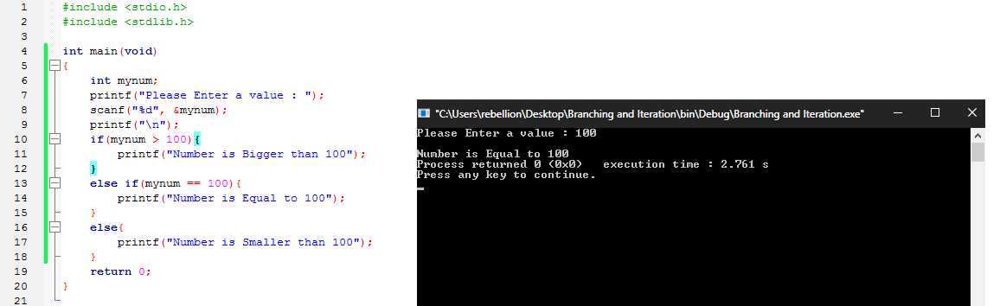
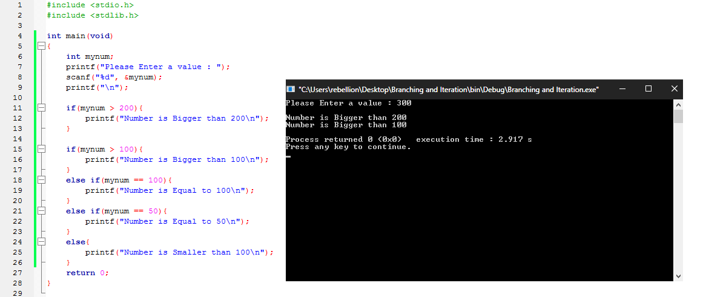
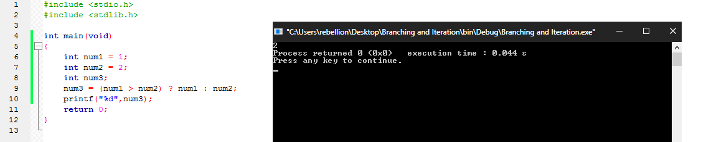
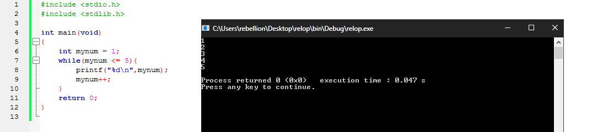
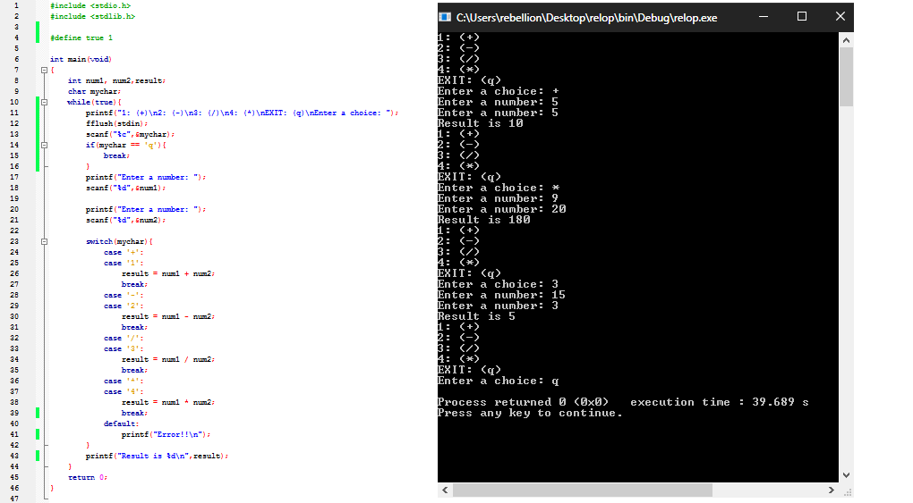
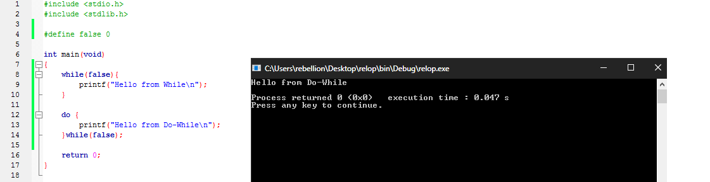
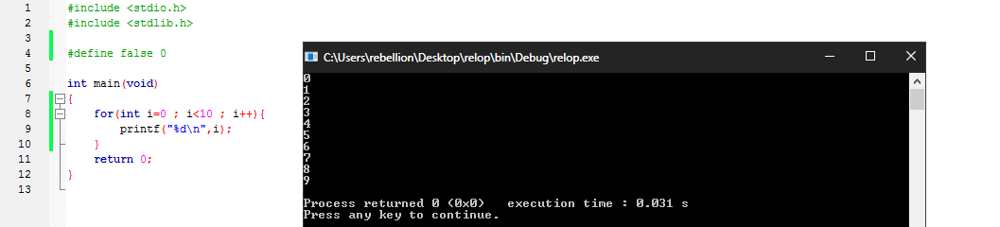
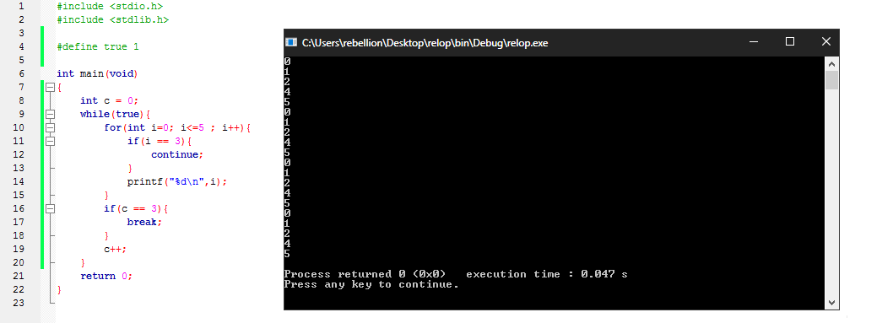
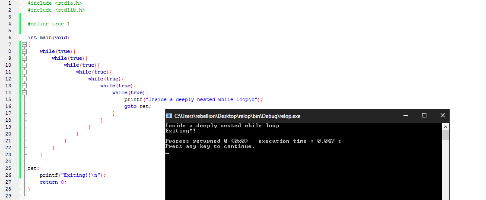

### ==التفرع والتكرار Branching and Iteration==

> توفر لغة C ثلاثة طرق لتحديد خط سير البرنامج وتفرعه عند نقاط معينة اثناء تنفيذه بالأعتماد علي الجمل الشرطية المتمثلة في المؤثرات العلاقية والمنطقية السابق ذكرها. 

و تتمثل في:

- `if`، `else` ، `else .. if` 
- التعبير الشرطي باستخدام `?` و`:` 
- `switch` 

كما توفر ثلاث طرق لتنفيذ حلقات التكرار وتنفسم الي:

- `while`
- `do .. while`
- `for`

بالإضافة إلي عبارة `goto` الغير مشهورة والغير مستخدمة بكثرة رغم قدرتها علي تغيير خط سير البرنامج بشكل غير مشروط وتنفيذ حلقات التكرار.

و تحتوي تلك الطرق سواء كانت جمل شرطية او حلقات تكرار علي بناء من الأكواد بداخلها يتم وضعه بين الحضانات `{}` ويسمي Block كما في الدوال Functions ولكن ما يحدد تنفيذ او عدم تنفيذ تلك الأكواد هو صحة او بطلان الجملة الشرطية المُستخدمة، فإذا كانت تساوي القيمة `0` فذلك يمثل `false` ويعني بطلان الجملة الشرطية، اما في حالة عدم مساواته للرقم `0` كمثال  `1` فذلك يمثل `true` ويدل علي صحة الجملة الشرطية مما سيترتب عليه تنفيذ الـ Block المراد تنفيذه في حالة صحة الشرط.


#### ==الجمل الشرطية باستخدام if، else، else .. if==

الجمل الشرطية باستخدام `if` تأخذ الشكل التالي:

```C
if(expression){
   statement;
   statement;
   statement;
}
```

الأمثلة التالية توضح أستخدام `if` `else` `else .. if`:

```C
#include <stdio.h>
#include <stdlib.h>

int main(void)
{
    int mynum;
    printf("Please Enter a value : ");
    scanf("%d"، &mynum);
    printf("\n");
    if(mynum > 100){
        printf("Number is Bigger than 100");
    }
    return 0;
}
```


في المثال السابق قمنا بسؤال المستخدم وانتظاره لإدخال رقم وفي حالة أن الرقم كان اكبر من `100` سيتم طباعة الجملة `Number is Bigger than 100`. البرنامج يعمل بشكل جيد ولكن يمكننا تحسينه باستخدام `else` ليقوم بطباعة رسالة تخبر المٌستخدم أن الرقم الذي ادخله اصغر من `100` كما في المثال التالي:

```C
#include <stdio.h>
#include <stdlib.h>

int main(void)
{
    int mynum;
    printf("Please Enter a value : ");
    scanf("%d"، &mynum);
    printf("\n");
    if(mynum > 100){
        printf("Number is Bigger than 100");
    }
    else{
        printf("Number is Smaller than 100");
    }
    return 0;
}
```



لاحظ كيف تقوم `else`بتنفيذ الـ Block الخاص بها في حالة عدم صحة الشروط التي سبقتها داخل الجملة الشرطية الواحدة، ولكن المشكلة هنا انه إن كان الرقم يساوي `100` فسيتم طباعة نفس الرسالة `Number is Smaller than 100` وهذا خطأ. يمكننا تصحيح ذلك باستخدام `else if`  كما في المثال التالي:

```C
#include <stdio.h>
#include <stdlib.h>

int main(void)
{
    int mynum;
    printf("Please Enter a value : ");
    scanf("%d"، &mynum);
    printf("\n");
    if(mynum > 100){
        printf("Number is Bigger than 100");
    }
    else if(mynum == 100){
        printf("Number is Equal to 100");
    }
    else{
        printf("Number is Smaller than 100");
    }
    return 0;
}
```



لاحظ أن استخدام `else` و`else if` هو أمر اختياري عند استخدام `if` مع وجود فارق بينهم حيث يمكن استخدام اكثر من `else if` ولكن لا يمكن استخدام اكثر من `else` واحدة داخل الجملة الشرطية، ويجب مراعاة أن استخدام  `if` يعني بدأ جملة شرطية مفصولة عن التي قبلها او بعدها كما في المثال التالي:

```c
#include <stdio.h>
#include <stdlib.h>

int main(void)
{
    int mynum;
    printf("Please Enter a value : ");
    scanf("%d"، &mynum);
    printf("\n");

    if(mynum > 200){
        printf("Number is Bigger than 200\n");
    }

    if(mynum > 100){
        printf("Number is Bigger than 100\n");
    }
    else if(mynum == 100){
        printf("Number is Equal to 100\n");
    }
    else if(mynum == 50){
        printf("Number is Equal to 50\n");
    }
    else{
        printf("Number is Smaller than 100\n");
    }
    return 0;
}
```



لاحظ كيف تم تنفيذ الـ Block في كلي الجملتين لصحته ولم يتم تنفيذ اول شرط صحيح كما في الأمثلة السابقة بسبب استقلال الجملتين عن بعضهم.


#### ==التعبير الشرطي باستخدام `?` و`:`==

يتم استخدام تلك الطريقة فقط مع الشروط البسيطة والتي لا تحتاج اكثر من سطر واحد لتنفيذها وتأتي علي الشكل التالي:

```C
(expression 1) ? (expression 2) : (expression 3)
```

حيث يتم تنفيذ التعبير الثاني في حالة صحة التعبير الأول والتعبير الثالث في حالة بطلان التعبير الأول كمثال:

```c
#include <stdio.h>
#include <stdlib.h>

int main(void)
{
    int num1 = 1;
    int num2 = 2;
    int num3;
    num3 = (num1 > num2) ? num1 : num2;
    printf("%d"،num3);
    return 0;
}

```



لاحظ أن قيمة `num3` تم تعيينها لتساوي `2` بسبب كون `num1` اصغر من `num2`.


#### ==الجمل الشرطية باستخدام switch==

يتم استعمال جمل `siwtch` بدلا من جمل `if` عندما نريد مقارنة متغير واحد مع العديد من الثوابت وتأخذ جمل `switch` الشكل التالي: 

```C
switch (expression) {
case const-int-expr: statements
case const-int-expr: statements
default: statements
}
```

ويساوي `default` داخل جمل `switch`  استعمال `else` داخل جمل `if`،  وفي حالة عدم إنهاء الـ Block داخل جملة `switch` بكتابة `break` سيتم التأكد من صحة باقي الشروط بشكل تسلسلي. المثال التالي يوضح الفرق بين آلة حاسبة بسيطة تمت كتابتها باستخدام `if` وآخري باستخدام `switch`:

```C
#include <stdio.h>
#include <stdlib.h>

int main(void)
{
    int num1، num2،result;
    char mychar;

    printf("1: (+)\n2: (-)\n3: (/)\n4: (*)\nEnter a choice: ");
    scanf("%c"،&mychar);

    printf("Enter a number: ");
    scanf("%d"،&num1);

    printf("Enter a number: ");
    scanf("%d"،&num2);

    if(mychar == '+' || mychar == '1'){
        result = num1 + num2;
    }
    else if(mychar == '-' || mychar == '2'){
        result = num1 - num2;
    }
    else if(mychar == '/' || mychar == '3'){
        result = num1 / num2;
    }
    else if(mychar == '*' || mychar == '4'){
        result = num1 * num2;
    }
    else{
        printf("Error!!");
        return 1;
    }
    printf("Result is %d"،result);
    return 0;
}
```

```C
#include <stdio.h>
#include <stdlib.h>

int main(void)
{
    int num1، num2،result;
    char mychar;

    printf("1: (+)\n2: (-)\n3: (/)\n4: (*)\nEnter a choice: ");
    scanf("%c"،&mychar);

    printf("Enter a number: ");
    scanf("%d"،&num1);

    printf("Enter a number: ");
    scanf("%d"،&num2);

    switch(mychar){
        case '+':
        case '1':
            result = num1 + num2;
            break;
        case '-':
        case '2':
            result = num1 - num2;
            break;
        case '/':
        case '3':
            result = num1 / num2;
            break;
        case '*':
        case '4':
            result = num1 * num2;
            break;
        default:
            printf("Error!!");
            return 1;
    }
    printf("Result is %d"،result);
    return 0;
}
```


لاحظ ورغم زيادة عدد الأسطر في مثال `switch` الي ان البرنامج اسهل واسرع في قراءته وكتابته من مثيله في `if`.


#### ==حلقات التكرار باستخدام while==

تأخذ حلقات `while` الشكل العام التالي: 

 ```C
while (expression){
   statement;
   statement;
}
 ```

ويتم استخدام الحلقات بشكل عام لتكرار الـ Block بعدد مرات معين حتي تبطل صحة الجملة الشرطية المُستخدمة، المثال التالي يوضح استخدام `while` في كتابة حلقة تقوم بالعد من `1` الي `5`:

```C
#include <stdio.h>
#include <stdlib.h>

int main(void)
{
    int mynum = 1;
    while(mynum <= 5){
        printf("%d\n"،mynum);
        mynum++;
    }
    return 0;
}
```



و يمكن استخدام الحلقات في إنشاء برامج اكثر تفاعلية فكمثال يمكن التعديل علي برنامج الآلة الحاسبة السابق باستخدام `while` لنتمكن من عمل أكثر من مسئلة حسابية بدون الحاجة الي إعادة تشغيل البرنامج في كل مرة.

```C
#include <stdio.h>
#include <stdlib.h>

#define true 1

int main(void)
{
    int num1، num2،result;
    char mychar;
    while(true){
        printf("1: (+)\n2: (-)\n3: (/)\n4: (*)\nEXIT: (q)\nEnter a choice: ");
        fflush(stdin);
        scanf("%c"،&mychar);
        if(mychar == 'q'){
            break;
        }
        printf("Enter a number: ");
        scanf("%d"،&num1);

        printf("Enter a number: ");
        scanf("%d"،&num2);

        switch(mychar){
            case '+':
            case '1':
                result = num1 + num2;
                break;
            case '-':
            case '2':
                result = num1 - num2;
                break;
            case '/':
            case '3':
                result = num1 / num2;
                break;
            case '*':
            case '4':
                result = num1 * num2;
                break;
            default:
                printf("Error!!\n");
        }
        printf("Result is %d\n"،result);
    }
    return 0;
}

```



في المثال السابق تم تعيين الثابت الرمزي `true` بقيمة `1` واستخدامه كعبارة شرطية لحلقة `while` مما يضمن استمرار الحلقة الي ما لا نهاية لأن ناتج الشرط في هذه الحالة هو قيمته. وتسمي الحلقات من ذلك النوع `infinite loops`، بعد ذلك تم استخدام `if` للتأكد ما إذا كان اختيار المستخدم يساوي الحرف `q` وفي حالة انه يساويه سيتم كسر حلقة `while` باستخدام `break`، لاحظ استخدام `break` بشكل عام لللإنهاء الـ Block الذي يتم تنفيذه في أكثر من موضع مثل حلقات `while` وجمل `switch`.


#### ==حلقات التكرار باستخدام do .. while==

تمتلك حلقات الـ `do while` الشكل العالم التالي:

```C
do {
   statement;
} while (expression);
```

وتتشابه كثيرا مع  حلقات `while` ولكن الفرق يكمن في التحقق من صحة الشرط بعد تنفيذه مما يعني أن الـ Block الخاص بحلقات `do while` سيتم تنفيذه علي الأقل مرة واحدة. المثال التالي يوضح الفرق بين `while` و`do while` في تنفيذ الـ Block بناء علي شرط غير صحيح. 

```C
#include <stdio.h>
#include <stdlib.h>

#define false 0

int main(void)
{
    while(false){
        printf("Hello from While\n");
    }

    do {
        printf("Hello from Do-While\n");
    }while(false);

    return 0;
}

```



لاحظ أن `while` لم تقم بتنفيذ اي شيء بعكس `do while`.


#### ==حلقات التكرار باستخدام for==

تمتلك حلقات `for` الشكل العام التالي:

```c
for (expression1; expression2; expression3){
	statement;
}
```

و تستخدم لتكرار الـ Block بعدد مرات معين، اما عن وسائط حلقات `for` فهم ثلاثة؛ يمثل الوسيط في المنتصف الجملة الشرطية  التي سيتم التحقق منها، اما الوسيط الأول فيتم استخدامه لتعيين متغير بقيمة يبدأ العد من عندها ويتدرج بالشكل الذي يحدده الوسيط الثالث سواء بالزيادة او النقصان. المثال التالي يشرح استخدام حلقات `for` للطباعة من الرقم `0` حتي الرقم `9`.

```c
#include <stdio.h>
#include <stdlib.h>

int main(void)
{
    for(int i=0 ; i<10 ; i++){
        printf("%d\n"،i);
    }
    return 0;
}
```



لاحظ كيف يمكننا استخدام المتغير في الوسيط الأول داخل الـ Block مع ذلك استخدامه خارجه سيعطي رسالة خطأ.

```c
#include <stdio.h>
#include <stdlib.h>

int main(void)
{
    for(int i=0 ; i<10 ; i++){
        printf("%d\n"،i);
    }
    printf("%d"،i); /* Error */
    return 0;
}
```

هذا بسبب ان نطاق المتغير محدود ببداية و نهاية الحلقة فقط و ليس علي نطاق الدالة ككل، يمكن حل تلك المشكلة بتعريف المتغير `i` قبل بداية الحلقة علي النحو التالي

```c
#include <stdio.h>
#include <stdlib.h>

int main(void){
    int i = 0;
    for (i; i<10; i++){
        printf("Inside  Loop %d\n",i);
    }
    printf("Outside Loop %d",i); // Outside Loop 10 //
    return 0;
}

```

سيتم شرح النطاقات تفصيلا في الأجزاء القادمة بإذن الله.


#### ==استخدام Break وContinue==

كما رأينا بالفعل يمكننا استخدام `break` لإنهاء الحلقات وجمل `siwtch` بينما يتم استخدام `continue` في الحلقات فقط لتخطي باقي الـ Block والعودة مباشرة الي بداية الحلقة ليتم استكمالها. المثال التالي يوضح استخدام `break` و`continue` 

```c
#include <stdio.h>
#include <stdlib.h>

#define true 1

int main(void)
{
    int c = 0;
    while(true){
        for(int i=0; i<=5 ; i++){
            if(i == 3){
                continue;
            }
            printf("%d\n"،i);
        }
        if(c == 3){
            break;
        }
        c++;
    }
    return 0;
}

```



لاحظ كيف تم كسر حلقة `while` بعد `4` مرات من تنفيذها بداية من الرقم `0` حتي `3` مع تجنب طباعة الرقم `3` داخل حلقة `for`. 


#### ==استخدام goto== 

بالرغم من السمعة السيئة عن `goto` في إنتاج برنامج صعب القراءة وغير منظم إلا انها مفيدة في بعض الأحيان ويوفر استخدامها سهولة في التنقل بين اجزاء الـ Block التابع لنفس الدالة. المثال التالي يوضح استخدام `goto` للخروج من عدة حلقات لا نهائية بشكل بسيط دون الحاجة الي إعادة استخدام `break` في كل مرة واستكمال البرنامج عند الـ label المسمي `ret`:

```c
#include <stdio.h>
#include <stdlib.h>

#define true 1

int main(void)
{
    while(true){
        while(true){
            while(true){
                while(true){
                    while(true){
                        while(true){
                            while(true){
                                printf("Inside a deeply nested while loop\n");
                                goto ret; // goto label //
                            }
                        }
                    }
                }
            }
        }
    }

ret: // defined label //
    printf("Exiting!!\n");
    return 0;
}

```

